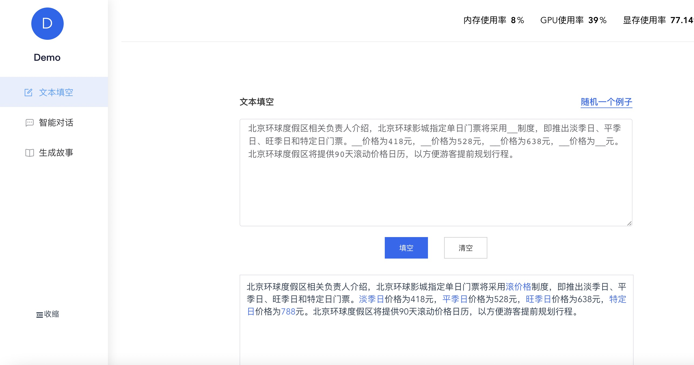
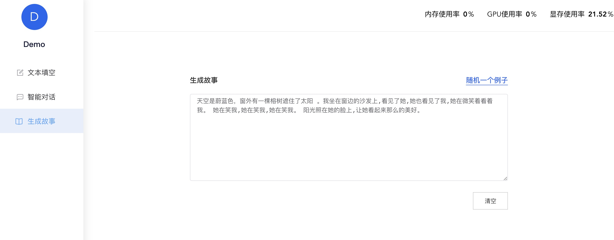
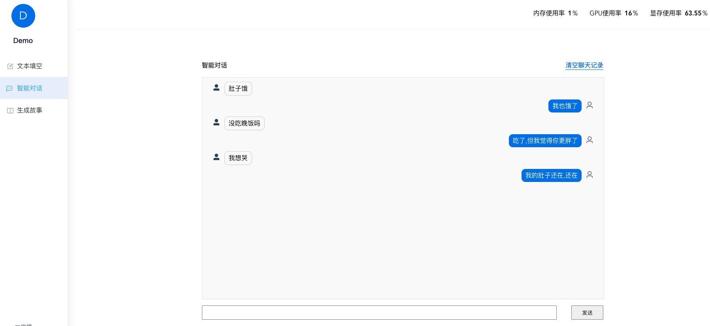

# **Introduction**

BMInf(Big Model Inference)-Demos is three examples designed according to three models in BMInf. These three examples are:
+ **Fill Blank.** It is a use case designed according to CPM2.1 model. It can support arbitrary input of a paragraph of text and generate corresponding blank content according to context semantics.
+ **Generate Story.** It is an example based on CPM1 model. You only need to write the beginning of a paragraph, and it can create a beautiful essay for you。
+ **Dialogue.** It is an example we created based on EVA2 model. Here, you can talk freely with the machine.

# Usage


### Step1: 
Run following commands with `nvidia-docker2`.

```console
$ docker run -it --gpus 1 -v $HOME/.cache/bigmodels:/root/.cache/bigmodels -p 0.0.0.0:8000:8000 --rm openbmb/bminf-demos
```

### Step2:

Visit http://localhost:8000/ with your browser.


# **Demonstration**
+ Fill Blank 
<div  align="center">    

</div>


+ Generate Story

<div  align="center">    

</div>

+ Dialogue

<div  align="center">    

</div>


# **Install**

+ From docker: 
Launch later
